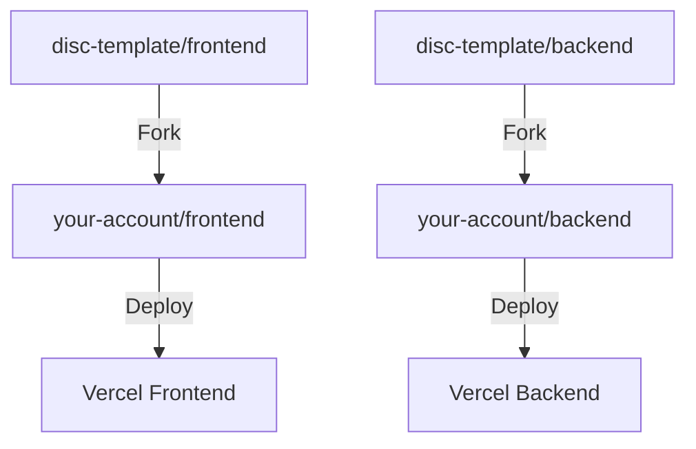

# Getting Started

:::info

**This entire setup should setup should be done only by _one person_ on the team** It should take anywhere between 3-6 hours to complete

if you are not the member of your team responsible for setting up the starter template, scroll to the bottom
:::

### Creating Your GitHub Account

1. You need to create your own GitHub account (unless one was provided to you from your client) at https://github.com/signup if they don't already have one
2. Complete your GitHub profile setup and verify your email address

### Forking the Template Repositories

Next, you need too:

1. Navigate to the template repositories:
   - Frontend: https://github.com/disc-template/frontend
   - Backend: https://github.com/disc-template/backend
2. Click the "Fork" button in the top-right corner of each repository
3. Select your personal GitHub account as the destination for the fork



## Prerequisites

Before you begin, make sure you have:

- [Node.js](https://nodejs.org/) version 18.0 or higher
- [Git](https://git-scm.com/) for version control
- A code editor (we recommend [VS Code](https://code.visualstudio.com/))
- [Supabase](https://supabase.com/) account
- [Google Cloud Console](https://console.cloud.google.com/) account (for OAuth)

## Installation

0. Setup directories

```bash
cd # whereever you want your code to live in, make sure you can easily access this in the future
mkdir disc-template
```

1. Clone the repositories:

```bash
git clone https://github.com/YOUR_NEW_GITHUB_ACCOUNT/frontend.git
git clone https://github.com/YOUR_NEW_GITHUB_ACCOUNT/backend.git
```

2. Install dependencies for the frontend:

```bash
cd frontend
npm i
```

3. Create the `.env` file for the frontend

```bash
touch .env
```

4. Copy this template for the frontend `.env`

```javascript
REACT_APP_BACKEND_URL=http://localhost:5050
```

5. Change directories into the backend

```bash
cd ..
cd backend
```

6. Install dependencies for the backend

```bash
npm i
```

7. Create `.env` file for the backend

```bash
touch .env
```

8. Copt this template for the backend `.env`

```javascript
SUPABASE_URL= #your supabase url here
SUPABASE_ANON_KEY= # your supabase anon key here
PORT=5050 # this is the default that we used when making the template
FRONTEND_URL=http://localhost:3001 # this is the default we used when making the template
API_URL=http://localhost:5050 # this is the default we used when making the template
FRONTEND_URL_DEV=http://localhost:3001 # this is the default we used when making the template
NODE_ENV=development # NOTE: you should change this to `production` when you deploy to vercel!!!!
```

## Supabase Setup

### 1. Create a Project

1. Go to [Supabase Dashboard](https://supabase.com/dashboard)
2. Click "New Project"
3. Fill in project details

### 2. Create Users Table

Run this SQL in the Supabase SQL editor:

```sql
CREATE TABLE users (
  id UUID DEFAULT uuid_generate_v4() PRIMARY KEY,
  username VARCHAR(255) UNIQUE NOT NULL,
  email VARCHAR(255) UNIQUE NOT NULL,
  firstname VARCHAR(255),
  lastname VARCHAR(255),
  created_at TIMESTAMP WITH TIME ZONE DEFAULT TIMEZONE('utc'::text, NOW()),
  updated_at TIMESTAMP WITH TIME ZONE DEFAULT TIMEZONE('utc'::text, NOW())
);
```

<!-- ### 3. Configure Authentication

1. Go to Authentication settings in Supabase dashboard
2. Enable Email auth provider
3. Configure Email templates (optional) _do not worry about this for now please_
4. Set Site URL to your frontend URL \_this is going to be localhost to start off, you will change it to your deployed url on vercel later -->

### 3. Configure Authentication

1. Go to Authentication settings in Supabase dashboard:

   - Log into your Supabase account

   - Select your project

   - Click on "Authentication" in the left sidebar

   - Click on "Providers" tab

2. Enable Email auth provider:

   - Find "Email" in the list of providers

   - Toggle the switch to enable it

   - Under "Email Provider Settings", keep defaults for now

3. Set Site URL to your frontend URL:

   - In the left sidebar, click on "URL Configuration"

   - For Site URL, enter: http://localhost:3001

   - Save changes

   - Note: You'll update this to your Vercel URL after deployment

## Google OAuth Setup

:::info
Note that for this section, you will _not_ be able to do the following steps with your northwestern email! Either create a new gmail account for a team or delegate someone to be the sole owner of the google cloud console
:::

### 1. Google Cloud Console Setup

1. Create a new project:

   - Go to [Google Cloud Console](https://console.cloud.google.com/)
   - Click the project dropdown at the top
   - Click "New Project"
   - Enter a project name and click "Create"

2. Enable Google OAuth API:

   - In the left sidebar, go to "APIs & Services" > "Library"
   - Search for "Google OAuth2"
   - Click on "Google OAuth2 API"
   - Click "Enable"

3. Configure OAuth consent screen:

   - Go to "APIs & Services" > "OAuth consent screen"
   - Choose "External" user type
   - Fill in required fields:
     - App name
     - User support email
     - Developer contact email
   - For Scopes, add: "email" and "profile"
   - Skip adding test users for now
   - Click "Save and Continue" through remaining steps

4. Create OAuth 2.0 Client ID:
   - Go to "APIs & Services" > "Credentials"
   - Click "Create Credentials" > "OAuth client ID"
   - Choose "Web application" as Application type
   - Name your client
   - Add these Authorized redirect URIs:
     - `[YOUR_SUPABASE_URL]/auth/v1/callback`
       (Find your Supabase URL in your project settings)
     - `http://localhost:3000/auth/callback`
   - Click "Create"
   - **Important**: Save the Client ID and Client Secret that appear - you'll need these for Supabase

### 2. Supabase OAuth Configuration

1. Configure Google provider in Supabase:
   - In your Supabase dashboard, go to Authentication > Providers
   - Find Google in the list
   - Toggle to enable it
   - Paste your Google Client ID and Client Secret from the previous step
   - Save changes

## Verify Setup

For both the frontend and backend directories just do the following:

_you will probably need to open two terminals for this!_

```bash
npm start
```

Backend server will start at `http://localhost:5050`

Frontend server will start at `http://localhost:3001`

1. Your authentication should now be configured for both email and Google login
2. Test both methods in development:
   - Run your frontend locally (`npm run dev`)
   - Try creating an account with email
   - Try signing in with Google
   - If either fails, double-check all URLs and credentials

After you have gone through all of these steps, you should be able to create users, see them populate on Supabase, and have them displayed on your web app after logging in.

You should also get emails from Supabase whenever you first sign-up and requests a password. All of the respective pages on the frontend should work with this as well.

:::note

Once you have verified that **everything** works, share the `.env` credentials with the rest of your team!!!

:::

## Development Tools

### Recommended VS Code Extensions

- [ESLint](https://marketplace.visualstudio.com/items?itemName=dbaeumer.vscode-eslint)
- [Prettier](https://marketplace.visualstudio.com/items?itemName=esbenp.prettier-vscode)

### Available Scripts

- `npm run dev` - Start development server
- `npm start` - Start production server
- `npm test` - Run tests
- `npm run lint` - Run ESLint
- `npm run format` - Format code with Prettier

## Instructions for Everyone Else

If you are **not** the member of your team who did all of the steps from above:

1. Clone the _forked_ repos from the github account that setup all of the accounts and projects for you
2. Get the respective `env` variables.
3. Verify that everything is running locally
