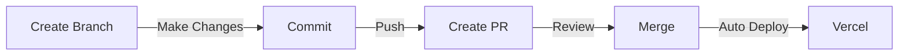

# Getting Started with DISCover Program Templates

This guide will walk you through setting up your team's development environment using our template repositories.

## Repository Setup

### Initial Setup by Tech Lead

1. The team's tech lead will receive access to the `disc-template` GitHub organization
2. Tech lead needs to create two new repositories by copying from our templates:
   - Frontend: `https://github.com/disc-template/frontend`
   - Backend: `https://github.com/disc-template/backend`


### Team Access

1. Tech lead adds team members as collaborators to both repositories
2. Each team member then:

```bash
# Clone frontend repository
git clone https://github.com/your-team-name/frontend.git

# Clone backend repository
git clone https://github.com/your-team-name/backend.git
```

## Development Workflow



### Step-by-Step Process

1. Create feature branch:

```bash
git checkout -b feature/your-feature-name
```

2. Make changes and commit:

```bash
git add .
git commit -m "feat: description"
git push origin feature/your-feature-name
```

3. Create Pull Request and get reviews
4. Merge to main triggers automatic deployment

## Why This Structure?

Our repository structure is designed to:

- Enable free deployments on Vercel
- Maintain separate environments for each team
- Keep codebase organized and manageable
- Enable proper code review processes

## Next Steps

- Set up the [Backend Environment](./backend/getting-started)
  º
