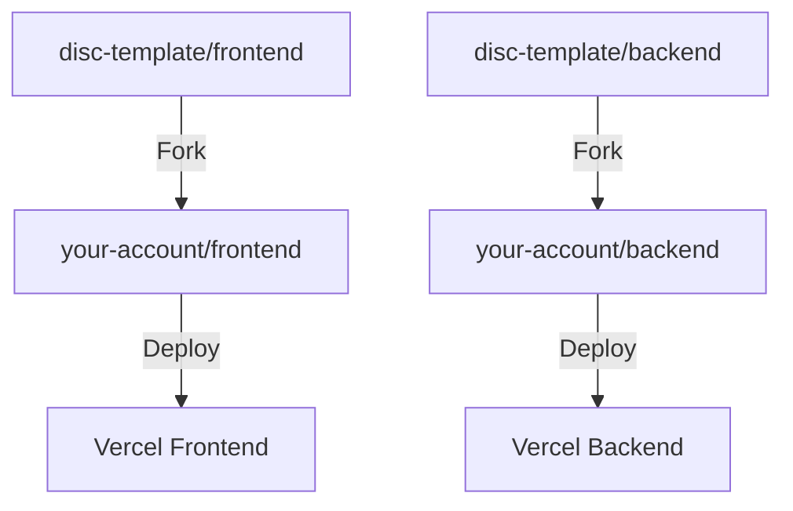

# Getting Started with DISCover Program Templates

This guide will walk you through setting up your team's development environment using our template repositories.

## Repository Setup

### Creating Your GitHub Account

1. Each team needs to create their own GitHub account at https://github.com/signup if they don't already have one
2. Complete your GitHub profile setup and verify your email address

### Forking the Template Repositories

Each team member needs to:

1. Navigate to the template repositories:
   - Frontend: `https://github.com/disc-template/frontend`
   - Backend: `https://github.com/disc-template/backend`
2. Click the "Fork" button in the top-right corner of each repository
3. Select your personal GitHub account as the destination for the fork



### Setting Up Local Environment

After forking, each team member should:

```bash
# Clone your forked frontend repository
git clone https://github.com/your-username/frontend.git

# Clone your forked backend repository
git clone https://github.com/your-username/backend.git
```

## Development Workflow


### Step-by-Step Process

1. Create feature branch:

```bash
git checkout -b feature/your-feature-name
```

2. Make changes and commit:

```bash
git add .
git commit -m "feat: description"
git push origin feature/your-feature-name
```

3. Create Pull Request:

   - Go to your forked repository on GitHub
   - Click "Pull Request"
   - Set the base repository to your team's main repository
   - Get reviews from team members

4. After approval, merge to main to trigger automatic deployment

## Staying in Sync with Template Updates

To keep your fork updated with any changes from the template:

```bash
# Add the template repository as a remote
git remote add template https://github.com/disc-template/frontend.git  # or backend

# Fetch updates from template
git fetch template

# Merge template changes into your main branch
git merge template/main
```

## Why This Structure?

Our repository structure is designed to:

- Enable free deployments on Vercel
- Maintain separate environments for each team
- Keep codebase organized and manageable
- Enable proper code review processes
- Allow individual contributions through personal forks

## Next Steps

- Set up the [Backend Environment](./backend/getting-started)
- Configure your Vercel deployment
- Start collaborating with your team
