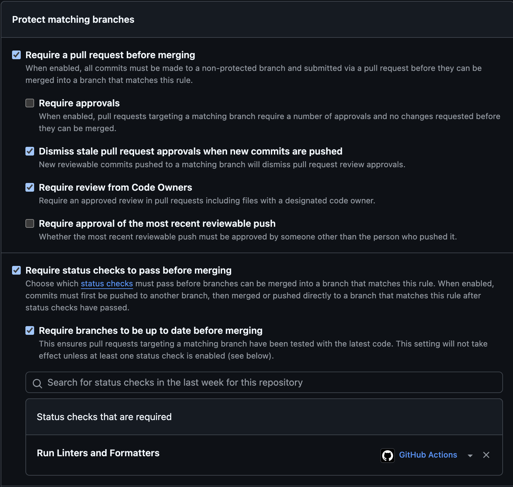

# GitHub Branch Protection Setup Guide

## Overview

:::info

This guide explains how to set up branch protection rules in GitHub to ensure code quality and maintain a secure development workflow.

:::

## Accessing Branch Protection Settings

1. Navigate to your repository on GitHub
2. Go to Settings > Branches
3. Under "Branch protection rules", click "Add rule"

## Required Protection Rules

### Required Pull Request Reviews

- Enable "Require a pull request before merging"
- This prevents direct commits to protected branches
- All changes must go through a pull request for review

### Code Owner Reviews

- Enable "Require review from Code Owners"
- Requires approval from designated code owners when their code is modified
- Code owners are defined in the CODEOWNERS (this will be the github usernames of the people in your team. You can see our example in starter template code) file in your repository

### Stale Review Dismissal

- Enable "Dismiss stale pull request approvals when new commits are pushed"
- Automatically removes review approvals when new changes are pushed
- Ensures latest code changes are always reviewed

### Status Checks

- Enable "Require status checks to pass before merging"
- Enable "Require branches to be up to date before merging"
- Ensures all required checks (like CI/CD pipelines) pass before merging
- Common status check: "Run Linters and Formatters"

### If you need a visual of what the branch portections should look like after you set them up, here it is:

